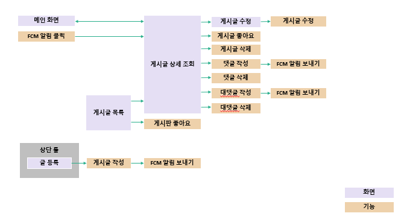

# SUDA - 실시간 채팅 커뮤니티 앱

  

**SUDA**는 실시간 채팅 기능을 중심으로 커뮤니티에서 원활한 소통을 돕는 모바일 앱입니다.  
사용자 간 실시간 대화, 그룹 채팅 및 알림 기능을 제공하며, 커뮤니티에서 다양한 활동을 지원합니다.

#### GitHub Link

* [App](https://github.com/GyeongNam/Suda-App)
* [Server](https://github.com/GyeongNam/Suda-Back)

 

## 📑 목차
1. [개발 인원](#-개발-인원)
2. [팀원별 역할](#-팀원별-역할)
3. [개발 환경](#-개발-환경)
4. [시스템 구성도](#-시스템-구성도)
5. [주요 기능](#-주요-기능)
6. [화면 예시](#-화면-예시)
7. [프로젝트 회고](#-프로젝트-회고)
8. [참고 자료 및 사용 도구](#-참고-자료-및-사용-도구)
9. [문서 및 자료](#-문서-및-자료)

 

## 👥 개발 인원

| 조경남 |                                                                  곽승지                                                                   |                                                                     최진웅                                                                      |
|:---:|:--------------------------------------------------------------------------------------------------------------------------------------:|:--------------------------------------------------------------------------------------------------------------------------------------------:| 
|    [@GyeongNam](https://github.com/GyeongNam) |   [@cannon397](https://github.com/cannon397) |   [@dorumamu](https://github.com/dorumamu) |

 

## 🔧 팀원별 역할

### 조경남
- **FCM 알림 기능 구현**: Firebase Cloud Messaging(FCM)을 이용하여 사용자에게 실시간 푸시 알림을 전송하는 기능을 구현했습니다.
- **웹소켓 기반 채팅방 개발**: 실시간 채팅을 위한 웹소켓 기술을 사용하여, 서버와 클라이언트 간 실시간 통신을 처리하는 채팅방 기능을 개발했습니다.
- **채팅 매칭 로직 구현**: 사용자가 원하는 채팅방에 접속할 수 있도록 채팅방 매칭 기능을 구현하였으며, 사용자가 실시간으로 참여할 수 있도록 했습니다.

### 곽승지
- **채팅방 구조 설계**: 채팅방의 데이터베이스 구조와 화면 구성 등을 설계하고 구현하여, 사용자가 편리하게 채팅을 즐길 수 있도록 기능을 개발했습니다.
- **계정 친구 추가 기능 설계 및 개발**: 사용자가 다른 사용자를 친구로 추가할 수 있는 기능을 설계하고 구현하여, 채팅방 초대 및 관리가 가능하도록 했습니다.
- **실시간 데이터 UI 업데이트**: 실시간으로 채팅 메시지가 화면에 나타날 수 있도록 UI를 업데이트하는 로직을 구현했습니다.

### 최진웅
- **안드로이드 내장 DB 구조 설계**: 앱 내에서 채팅 기록을 저장할 수 있도록 Android Room DB를 설계하고 구현했습니다.
- **SMS 인증번호 전송 기능 개발**: 사용자가 회원가입 시 전화번호 인증을 위한 SMS 인증번호 전송 기능을 구현했습니다.
- **게시글 등록, 수정 기능 개발**: 커뮤니티 게시판에 게시글을 등록하고 수정할 수 있는 기능을 구현하여, 사용자 간의 활발한 게시글 작성과 수정이 가능하도록 했습니다.

 

## ⚙️ 개발 환경

### Client

  
  
  

### Server

  
  
  
  

 

## 🖼 시스템 구성도

  

 

## 🛠 주요 기능

1. **실시간 채팅**
   
    - 1:1 및 다중 사용자 채팅 기능.
    - 실시간 알림 및 메시지 상태 확인.
    - 이미지 전송 및 데이터 저장 기능.

2. **커뮤니티 게시판**\
   
    - 게시글 및 댓글 작성/수정/삭제.
    - 알림 및 즐겨찾기 기능.

3. **알림 서비스**

   

    - FCM을 이용한 푸시 알림.
    - 게시글, 댓글 및 채팅방 이벤트 알림 제공.

4. **친구 추가 및 관리**
    - 사용자 간 친구 추가.
    - 채팅방 초대 및 관리 기능.

 

## 📸 화면 예시

  
  
  
  

1. 우측하단 + 클릭
2. 채팅방 이름과 인원 선택
3. 텍스트 입력 및 사진 전송
4. 우측상단 메뉴로 채팅방 인원 확인 및 채팅방 나가기 기능

 

## ✨ 프로젝트 회고

- **학습 및 성과**: 모바일 앱 개발의 기본 원리와 실시간 데이터 처리 구조에 대한 이해.
- **협업 경험**: 팀원 간의 역할 분담과 효율적인 협업 프로세스 구축.
- **도전과제 극복**: 실시간 채팅 기능 구현과 관련된 문제 해결 능력 강화.

 

## 📚 참고 자료 및 사용 도구

- **Firebase Cloud Messaging (FCM)**: [Firebase](https://firebase.google.com/docs/cloud-messaging)
- **Room Database**: [Room Database 공식 문서](https://developer.android.com/training/data-storage/room)
- **Laravel 문서**: [Laravel 7.x 공식 문서](https://laravel.kr/docs/7.x)
- **MySQL 공식 문서**: [MySQL Documentation](https://dev.mysql.com/doc/)
- **Apache 공식 문서**: [Apache HTTP Server](https://httpd.apache.org/)

 

## 📂 문서 및 자료

- **[발표 자료](./docs/Suda.pptx)**  
